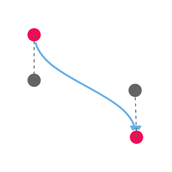

# Bezier Segment in ASP.NET Core Diagram

* Bezier segments are annotated with two thumbs to represent the control points. Control points of the curve can be configured by clicking and dragging the control thumbs.

