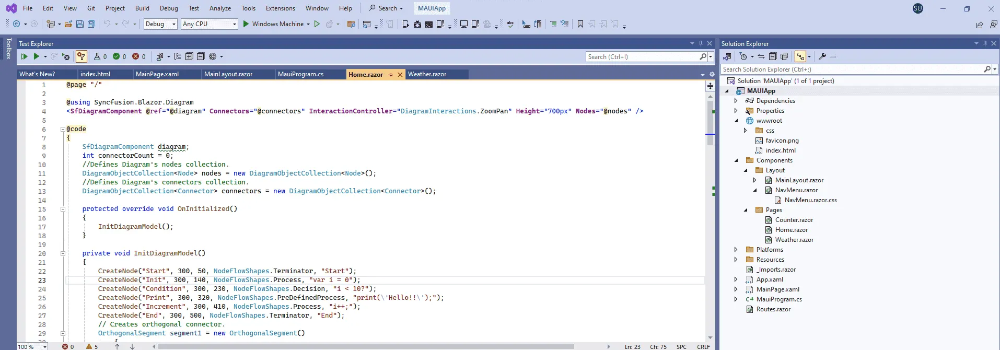
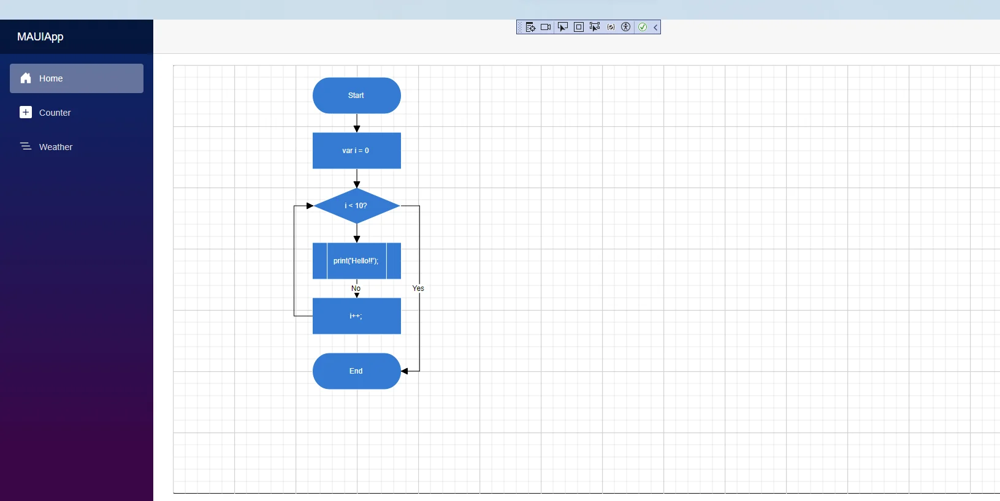
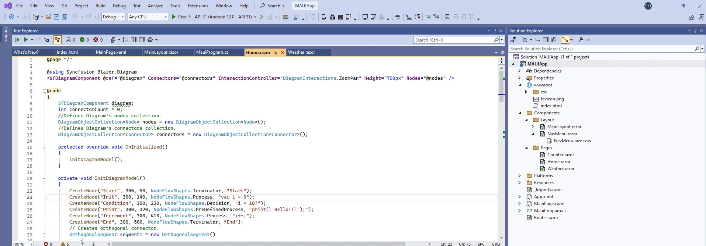
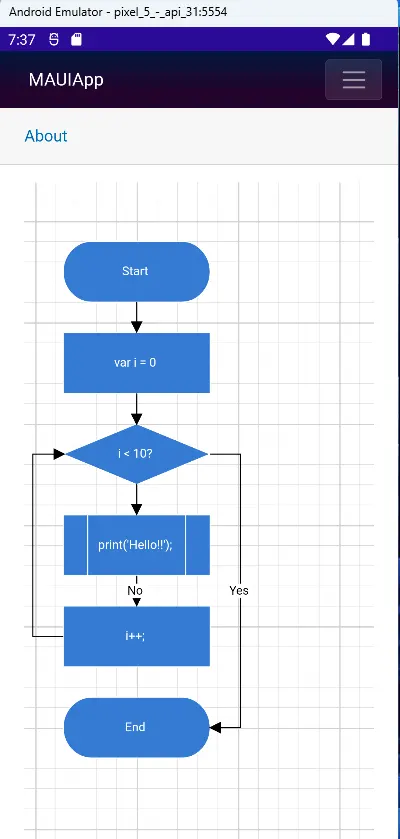

# Getting Started with the Diagram Component in the Blazor MAUI App

This section explains the step-by-step process of integrating the [Blazor Diagram](https://www.syncfusion.com/diagram-sdk/blazor-diagram) component in your Blazor MAUI App using both [Visual Studio](https://visualstudio.microsoft.com/vs/) and [Visual Studio Code](https://code.visualstudio.com/), and the [.NET CLI](https://learn.microsoft.com/en-us/dotnet/core/tools/).

> **Ready to streamline your Blazor development?**  Discover the full potential of Blazor components with AI Coding Assistants. Effortlessly integrate, configure, and enhance your projects with intelligent, context-aware code suggestions, streamlined setups, and real-time insights—all seamlessly integrated into your preferred AI-powered IDEs like VS Code, Cursor, Code Studio and more. [Explore AI Coding Assistants](https://blazor.syncfusion.com/documentation/ai-coding-assistant/overview).

## Create a new Blazor MAUI App





Create a Blazor MAUI App using Visual Studio via [Microsoft Templates](https://learn.microsoft.com/en-us/dotnet/maui/get-started/first-app?pivots=devices-windows&view=net-maui-9.0&tabs=vswin). For detailed instructions, refer to the [Syncfusion® Blazor MAUI App Getting Started](https://blazor.syncfusion.com/documentation/getting-started/maui-blazor-app) documentation.





Run the following command to create a new Blazor MAUI App.




dotnet new maui-blazor -o MauiBlazorApp
cd MauiBlazorApp




Alternatively, create a **Blazor MAUI App** using Visual Studio Code via [Microsoft Templates](https://learn.microsoft.com/en-us/dotnet/maui/get-started/first-app?pivots=devices-windows&view=net-maui-9.0&tabs=visual-studio-code) or the [Syncfusion® Blazor Extension](https://blazor.syncfusion.com/documentation/visual-studio-code-integration/create-project). For detailed instructions, refer to the [Blazor MAUI App Getting Started](https://blazor.syncfusion.com/documentation/getting-started/maui-blazor-app) documentation.





Run the following command to create a new Blazor MAUI App.




dotnet new maui-blazor -o MauiBlazorApp
cd MauiBlazorApp








## Install the required Blazor packages

Install the [Syncfusion.Blazor.Diagram](https://www.nuget.org/packages/Syncfusion.Blazor.Diagram) and [Syncfusion.Blazor.Themes](https://www.nuget.org/packages/Syncfusion.Blazor.Themes/) NuGet packages. All Syncfusion Blazor packages are available on [nuget.org](https://www.nuget.org/packages?q=syncfusion.blazor). See the [NuGet packages](https://blazor.syncfusion.com/documentation/nuget-packages) topic for details.





1. Go to *Tools → NuGet Package Manager → Manage NuGet Packages for Solution*.
2. Search the required NuGet packages (`Syncfusion.Blazor.Diagram` and `Syncfusion.Blazor.Themes`) and install them.

Alternatively, you can install the same packages using the Package Manager Console with the following command.




Install-Package Syncfusion.Blazor.Diagram -Version {{ site.releaseversion }}
Install-Package Syncfusion.Blazor.Themes -Version {{ site.releaseversion }}








Open the terminal and run the following command.




dotnet add package Syncfusion.Blazor.Diagram -v {{ site.releaseversion }}
dotnet add package Syncfusion.Blazor.Themes -v {{ site.releaseversion }}








Open the command prompt and run the following command.




dotnet add package Syncfusion.Blazor.Diagram -v {{ site.releaseversion }}
dotnet add package Syncfusion.Blazor.Themes -v {{ site.releaseversion }}








## Add import namespaces

After the packages are installed, open the **~/Components/_Imports.razor** file and import the `Syncfusion.Blazor` and `Syncfusion.Blazor.Diagram` namespaces.




@using Syncfusion.Blazor 
@using Syncfusion.Blazor.Diagram




## Register the Blazor service

Open the **MauiProgram.cs** file in Blazor MAUI App and register the Blazor service.




....
using Syncfusion.Blazor;
....

public static class MauiProgram
{
    public static MauiApp CreateMauiApp()
    {
        ....
        builder.Services.AddSyncfusionBlazor();
        ....
    }
}




## Add stylesheet and script resources

The theme stylesheet and script can be accessed from NuGet through [Static Web Assets](https://blazor.syncfusion.com/documentation/appearance/themes#static-web-assets). Include the [stylesheet](https://blazor.syncfusion.com/documentation/appearance/themes) and the [script references](https://blazor.syncfusion.com/documentation/common/adding-script-references) in the **~wwwroot/index.html** file.




....
<link href="_content/Syncfusion.Blazor.Themes/fluent2.css" rel="stylesheet" />
....
 




## Add Blazor Diagram component

Open a Razor file located in the **~/Components/Pages/*.razor** (for example, **Home.razor**) and add the [Blazor Diagram](https://www.syncfusion.com/diagram-sdk/blazor-diagram) component inside the razor file.




@using Syncfusion.Blazor.Diagram

<SfDiagramComponent @ref="@diagram" Connectors="@connectors" Height="700px" Nodes="@nodes" />

@code
{
    SfDiagramComponent diagram;
    int connectorCount = 0;
    //Defines Diagram's nodes collection.
    DiagramObjectCollection<Node> nodes = new DiagramObjectCollection<Node>();
    //Defines Diagram's connectors collection.
    DiagramObjectCollection<Connector> connectors = new DiagramObjectCollection<Connector>();

    protected override void OnInitialized()
    {
        InitDiagramModel();
    }

    private void InitDiagramModel()
    {
        CreateNode("Start", 300, 50, NodeFlowShapes.Terminator, "Start");
        CreateNode("Init", 300, 140, NodeFlowShapes.Process, "var i = 0");
        CreateNode("Condition", 300, 230, NodeFlowShapes.Decision, "i < 10?");
        CreateNode("Print", 300, 320, NodeFlowShapes.PreDefinedProcess, "print(\'Hello!!\');");
        CreateNode("Increment", 300, 410, NodeFlowShapes.Process, "i++;");
        CreateNode("End", 300, 500, NodeFlowShapes.Terminator, "End");
        // Creates orthogonal connector.
        OrthogonalSegment segment1 = new OrthogonalSegment()
        {
            Type = ConnectorSegmentType.Orthogonal,
            Direction = Direction.Right,
            Length = 30,
        };
        OrthogonalSegment segment2 = new OrthogonalSegment()
        {
            Type = ConnectorSegmentType.Orthogonal,
            Length = 300,
            Direction = Direction.Bottom,
        };
        OrthogonalSegment segment3 = new OrthogonalSegment()
        {
            Type = ConnectorSegmentType.Orthogonal,
            Length = 30,
            Direction = Direction.Left,
        };
        OrthogonalSegment segment4 = new OrthogonalSegment()
        {
            Type = ConnectorSegmentType.Orthogonal,
            Length = 200,
            Direction = Direction.Top,
        };
        CreateConnector("Start", "Init");
        CreateConnector("Init", "Condition");
        CreateConnector("Condition", "Print");
        CreateConnector("Condition", "End", "Yes", segment1, segment2);
        CreateConnector("Print", "Increment", "No");
        CreateConnector("Increment", "Condition", null, segment3, segment4);
    }

    // Method to create connector.
    private void CreateConnector(string sourceId, string targetId, string label = default(string), OrthogonalSegment segment1 = null, OrthogonalSegment segment2 = null)
    {
        Connector diagramConnector = new Connector()
        {
            // Represents the unique id of the connector.
            ID = string.Format("connector{0}", ++connectorCount),
            SourceID = sourceId,
            TargetID = targetId,
        };
        if (label != default(string))
        {
            // Represents the annotation of the connector.
            PathAnnotation annotation = new PathAnnotation()
            {
                Content = label,
                Style = new TextStyle() { Fill = "white" }
            };
            diagramConnector.Annotations = new DiagramObjectCollection<PathAnnotation>() { annotation };
        }
        if (segment1 != null)
        {
            // Represents the segment type of the connector.
            diagramConnector.Type = ConnectorSegmentType.Orthogonal;
            diagramConnector.Segments = new DiagramObjectCollection<ConnectorSegment> { segment1, segment2 };
        }
        connectors.Add(diagramConnector);
    }

    // Method to create node.
    private void CreateNode(string id, double x, double y, NodeFlowShapes shape, string label)
    {
        Node diagramNode = new Node()
        {
            //Represents the unique id of the node.
            ID = id,
            // Defines the position of the node.
            OffsetX = x,
            OffsetY = y,
            // Defines the size of the node.
            Width = 145,
            Height = 60,
            // Defines the style of the node.
            Style = new ShapeStyle { Fill = "#357BD2", StrokeColor = "White" },
            // Defines the shape of the node.
            Shape = new FlowShape() { Type = NodeShapes.Flow, Shape = shape },
            // Defines the annotation collection of the node.
            Annotations = new DiagramObjectCollection<ShapeAnnotation>
            {
                new ShapeAnnotation
                {
                    Content = label,
                    Style = new TextStyle()
                    {
                        Color="White",
                        Fill = "transparent"
                    }
                }
            }
        };
        nodes.Add(diagramNode);
    }
}




N> [View sample in GitHub](https://github.com/SyncfusionExamples/Blazor-Getting-Started-Examples/tree/main/DiagramComponent).

## Run the application on Windows





Press <kbd>Ctrl</kbd>+<kbd>F5</kbd> (Windows) or <kbd>⌘</kbd>+<kbd>F5</kbd> (macOS) to launch the application. The [Blazor Diagram](https://www.syncfusion.com/diagram-sdk/blazor-diagram) component will render in your default web browser.





Open the terminal and run the following command.




dotnet run








Open the command prompt and run the following command.




dotnet run








When the application is successfully launched, the Diagram component will seamlessly render the specified diagram page.

## Run the application on Android

To run the Blazor Diagram component in a Blazor Android MAUI application using the Android emulator, follow these steps:

Refer [here](https://learn.microsoft.com/en-us/dotnet/maui/android/emulator/device-manager#android-device-manager-on-windows) to install and launch Android emulator.

N> If you encounter any errors while using the Android Emulator, refer to the following link for troubleshooting guidance[Troubleshooting Android Emulator](https://learn.microsoft.com/en-us/dotnet/maui/android/emulator/troubleshooting).

## See also

1. [How to Create a Diagram Builder in MAUI platform](https://support.syncfusion.com/kb/article/11346/how-to-create-diagram-builder-in-maui-platform)
